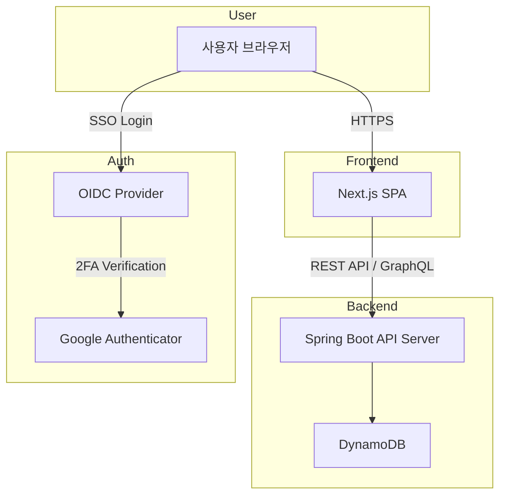

# 법인 홈페이지 PRD 
**문서 버전:** v1.0
**작성 날짜:** 2025.10.27

## 1. 프로젝트 개요

### 1.1 목적
법인의 통합 홈페이지를 구축하여, 회사의 **브랜드 정체성**, **사업 방향성**, **운영 시스템 통합(Single Sign-On)**, **대외 공고 및 사업 홍보**를 위한 플랫폼으로 활용한다.

### 1.2 목표
- 방문자에게 회사의 비전과 주요 활동을 명확히 전달
- 관리자가 직접 게시물을 등록, 수정, 삭제할 수 있는 **관리자 CMS 기능 제공**
- 법인 내에서 운영 중인 **여러 내부 시스템 간의 SSO 통합**
- **보안성 강화 (OIDC 기반 + 2FA)**

---

## 2. 서비스 구성

### 2.1 주요 기능 요약

| 구분 | 기능명 | 설명 |
|------|--------|------|
| 정적 페이지 | 메인페이지 | 회사 소개, 주요 사업, 홍보 이미지, 뉴스 슬라이드 |
| 정적 페이지 | 회사 비전/기업 이념 | 미션, 비전, 가치관, 연혁, 조직도 등 |
| 동적 페이지 | 게시판 (IR, 사업보고, 공고 등) | 관리자가 업로드한 게시물 자동 렌더링 |
| 시스템 연동 | SSO 로그인 | 운영 중인 타 시스템 계정 연동 |
| 보안 | 2FA 로그인 | Google Authenticator 기반 MFA 적용 |
| 관리자 기능 | 게시물/카테고리 관리 | CRUD 기능 제공 (텍스트, 이미지 업로드 포함) |
| 관리자 기능 | 접근 권한 관리 | 관리자 / 편집자 / 뷰어 등 역할별 권한 설정 |

---

## 3. 페이지 구조

### 3.1 정적 페이지
정적 페이지는 빌드 시점에 포함되며, 주로 회사 홍보 및 브랜드 아이덴티티를 위한 콘텐츠로 구성된다.

| 페이지명 | 경로 | 주요 내용 |
|-----------|-------|------------|
| 메인 페이지 | `/` | 회사 슬로건, 주요 사업, 배너, 최근 게시물 요약 |
| 회사 소개 | `/about` | 기업 개요, 연혁, 팀 구성, 위치 |
| 비전 및 이념 | `/vision` | 기업 철학, 비전, 핵심 가치 |
| 연락처 | `/contact` | 문의 폼, 이메일, 지도, 연락처 정보 |

### 3.2 동적 페이지
동적 페이지는 DB 기반 콘텐츠로, 관리자가 직접 게시글과 이미지를 업로드할 수 있다.

| 페이지명 | 경로 | 주요 내용 |
|-----------|-------|------------|
| 공지사항 | `/notice` | 공지/알림 게시물 리스트 |
| IR | `/ir` | 재무 정보, 사업보고서 등 문서 업로드 |
| 프로젝트 | `/projects` | 진행 중 또는 완료된 프로젝트 소개 |
| 언론 보도 | `/media` | 외부 기사, 보도자료, 인터뷰 등 |
| 카테고리 상세 | `/category/:slug` | 특정 카테고리별 게시물 렌더링 |

---

## 4. 관리자 페이지 (Admin Console)

### 4.1 접근 경로
- `/admin`  
- 접근 시 SSO 로그인 + 2FA 필수 인증 절차 수행

### 4.2 주요 기능

| 기능 | 설명 |
|------|------|
| 로그인/로그아웃 | OIDC 기반 로그인, Google Authenticator 2FA |
| 게시물 관리 | 게시물 CRUD (텍스트/이미지 업로드 포함) |
| 카테고리 관리 | 카테고리 추가, 수정, 삭제 |
| 사용자 관리 | 관리자/에디터 권한 부여 및 회수 |
| 미디어 관리 | 업로드된 이미지 및 문서 자산 관리 |
| 시스템 로그 | 로그인, 게시물 수정 이력 추적 |

---

## 5. 시스템 아키텍처

### 5.1 기술 스택

| 영역 | 기술 스택 |
|------|------------|
| Frontend | Next.js (SPA), TypeScript, Tailwind CSS |
| Backend | Java Spring Boot (경량화 버전) |
| Database | AWS DynamoDB |
| Authentication | OIDC (OpenID Connect), Google Authenticator (2FA) |
| Hosting | AWS (CloudFront + S3 + Lambda or EC2) |
| CI/CD | GitHub Actions or Argo CD |
| Monitoring | CloudWatch / Grafana (선택) |

### 5.2 서비스 구성도

---

## 6. 인증 및 보안 설계

### 6.1 인증 흐름
1. 사용자가 `/admin` 접속
2. OIDC 서버로 리다이렉트 → 로그인 인증 수행
3. 로그인 성공 후, MFA(2FA) 인증 코드 입력 요청
4. Google Authenticator에서 생성된 6자리 코드 검증
5. 토큰 발급 후 세션 확립 → 관리자 페이지 접근 허용

### 6.2 세부 정책
- Access Token 만료 시간: 15분
- Refresh Token 사용 가능 (30일)
- HTTPS 전용 통신
- CORS 정책: 회사 도메인만 허용
- 파일 업로드 시 S3 presigned URL 사용 (직접 업로드)

---

## 7. 데이터 모델 (DynamoDB)

### 7.1 게시물 (Post)
| 속성 | 타입 | 설명 |
|------|------|------|
| postId | String | 게시물 고유 ID |
| category | String | 카테고리명 |
| title | String | 제목 |
| content | String | 본문 (Markdown 지원) |
| thumbnailUrl | String | 썸네일 이미지 |
| author | String | 작성자 이름 |
| createdAt | ISODate | 작성일 |
| updatedAt | ISODate | 수정일 |

### 7.2 카테고리 (Category)
| 속성 | 타입 | 설명 |
|------|------|------|
| categoryId | String | 고유 ID |
| name | String | 카테고리 이름 |
| slug | String | URL friendly 이름 |
| description | String | 설명 |
| order | Number | 표시 순서 |

---

## 8. UI/UX 기본 가이드라인

- **컬러 톤:** 브랜드 정체성 반영 (화이트 + 미니멀 + 세련된 톤)
- **레이아웃:** 반응형 (Desktop / Mobile / Tablet)
- **네비게이션:** 상단 고정형 메뉴 + 하단 Footer
- **애니메이션:** Next.js Transition 및 Framer Motion 최소 적용
- **접근성:** 폰트 대비, 키보드 접근성 준수

---

## 9. 향후 확장 계획

| 구분 | 내용 |
|------|------|
| 단기 | SSO 기반 로그인 통합 (사내 Wiki, 문서 관리 시스템 등) |
| 중기 | 외부 API 연계 (지자체 사업 공고 자동 수집) |
| 장기 | 통합 대시보드 구축 (투자, 프로젝트, IR 연계 시각화) |
